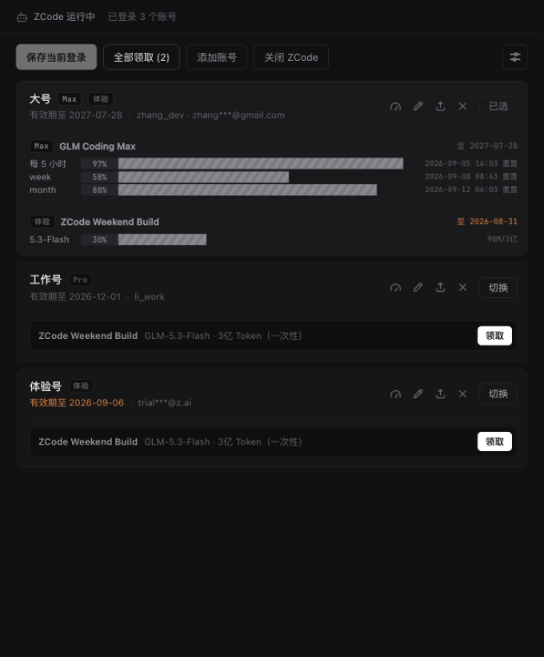

# Z·SWITCH (zcode-switch)

**简体中文** ｜ [English](README.en.md)

Tauri 2 桌面工具：在多个 ZCode 账号之间一键切换，自动显示额度。只换登录身份——项目、会话、设置全部共用不动。



## 功能

- **保存 / 切换账号**：快照 credentials + config 双文件，原子替换；切换前自动保全当前登录，绝不丢号
- **添加账号**：工具内 OAuth 登录新号（BigModel / z.ai 双入口），全程不动当前登录
- **额度展示**：账号行内联显示套餐额度与重置时间，多套餐分组、错峰轮询
- **活动领取**：可领套餐一键领取（GUI 验证码）
- **加密导入导出**：`.zsb` 捆绑包，PBKDF2(100k) + AES-256-GCM 口令加密
- **中英双语**：设置里一键切换 中文 / English，主窗、托盘、错误提示、CLI 输出全覆盖；首次运行按系统语言自动选择
- **托盘 / 开机自启 / CLI 自动化**

## 安全设计

- **本地优先**：所有数据在本地，无遥测、无远端存储；额度查询直连官方接口
- **WebView CSP（如实说明）**：`script-src` 基线为 `'self'`，但为加载阿里云验证码 SDK（领取活动的硬性要求，来源与 ZCode 客户端相同）放行了 `'unsafe-inline'`、`'unsafe-eval'` 与 `o.alicdn.com` / `*.alicdn.com`；`connect-src` 仅白名单放行 `*.aliyuncs.com`、`*.aliyun.com`、`ynuf.aliapp.org`（验证码设备指纹域）与 alicdn；`img-src` 放行 `https:` 仅因验证码弹窗素材域名不固定（纯图片资源，无脚本执行能力）。界面交互不依赖 `eval`，事件走白名单式分发
- **style-src 豁免说明**：`dangerousDisableAssetCspModification: ["style-src"]` 用于阻止 Tauri 追加 style hash——CSP 规范中 hash 与 `'unsafe-inline'` 互斥，注入 hash 会导致所有 `style=""` 内联属性被拦、界面渲染错乱
- **防丢号**：切换前自动保全未入库登录；文件写入走临时文件 + 原子 rename
- **路径穿越防护**：账号 id 白名单（`[A-Za-z0-9-]`），删除/读取均不可逃出账号库目录
- **加密导出**：PBKDF2-HMAC-SHA256（100k 迭代）+ AES-256-GCM，随机 salt/nonce；错密码即失败，无明文痕迹（有单测断言）
- **凭据只在本地解密**：enc:v1 解密仅用于显示用户名/邮箱；导出文件凭口令加密

## CLI

```
zcode-switch.exe --cli state|list
zcode-switch.exe --cli quota [--id <账号id>]
zcode-switch.exe --cli claim-preview [--id <账号id>]
zcode-switch.exe --cli capture [--name 名称]
zcode-switch.exe --cli switch --id <id> [--force] [--restart|--no-restart] [--hot <bool>|--no-hot]
zcode-switch.exe --cli kill
zcode-switch.exe --cli export --id <id> --out <a.zsb>
zcode-switch.exe --cli export-all --out <all.zsb>
zcode-switch.exe --cli import --file <file.zsb>
zcode-switch.exe --cli rename|delete|update|behavior|setpath|launch
zcode-switch.exe --cli --lang en state              # 英文输出（--lang 空格传值、可置于任意位置；默认跟 GUI 语言/系统语言）
```

CLI 密码（export / import）：优先环境变量 `ZSW_PASSWORD`（不出现在进程列表和命令历史），也可 `--password <密码>`。

## 构建

```bash
npm install
npm run tauri dev      # 开发（HMR）
`npm run dev          # 仅前端预览（浏览器打开 preview.html / preview-settings.html，内置 mock 数据，无需 Tauri）`
npm run tauri build    # NSIS 安装包
cd src-tauri && cargo test   # 单元测试（含 node↔Rust 跨语言加密向量）
```

Windows 优先（路径探测 / 进程管理 / 托盘均为 Win32 语义）。

## License

[MIT](./LICENSE)
